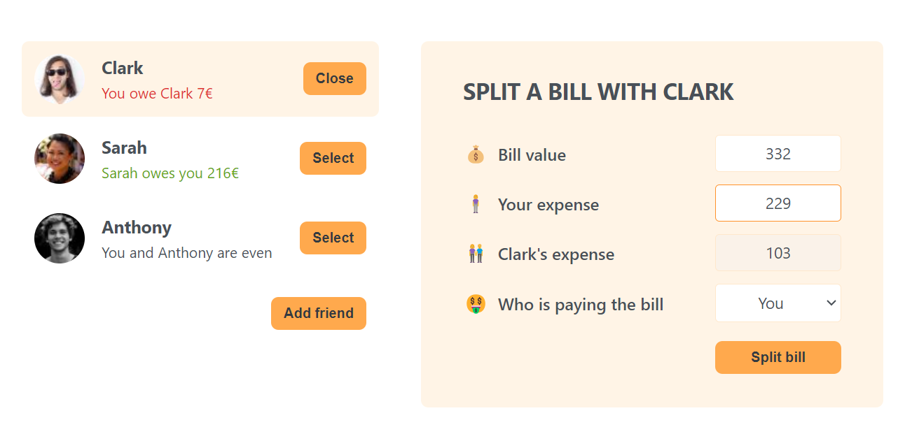

# Eat-n-split 🍽️

Welcome to the Eat-n-split repository! Your practice project for splitting restaurant bills! 🧾

  

## Description 📝

Eat-n-split is a practice project designed to help you master the art of splitting restaurant bills among friends or groups. With its intuitive user interface and simple functionality, it provides a hassle-free solution for dividing bills accurately.

## Key Features 🌟

- **Bill Splitting**: Easily split restaurant bills among multiple individuals or groups.
- **Customizable Options**: Adjust tip percentages, tax rates, and other parameters to customize bill splitting.
- **Practice Project**: Perfect for honing your skills in React and state management.

## Technologies Used 🛠️

- **React**: JavaScript library for building user interfaces.
- **State Management**: Implement state management solutions for handling bill data.
- **Git version control**: For secure and efficient code management.
- **Visual Studio Code**: Reliable code editor for development tasks.

